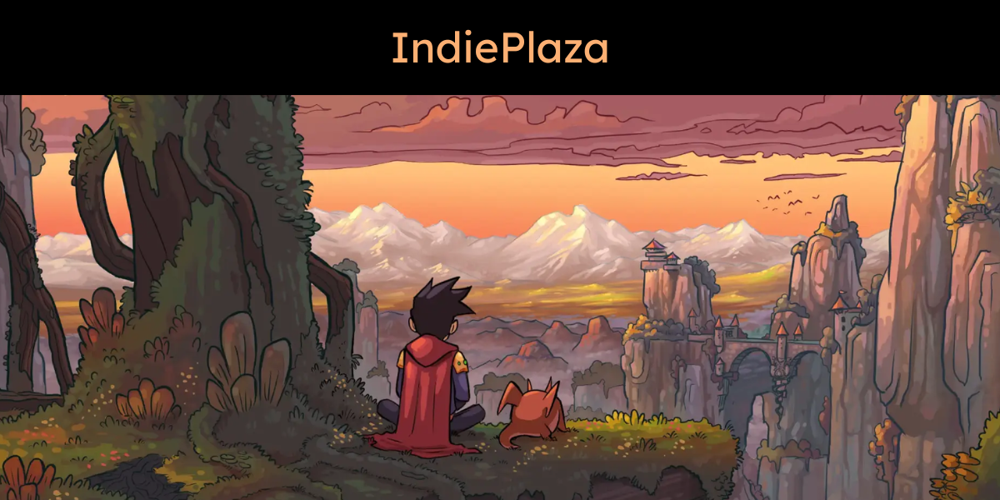

# Indie Plaza — Revenue Planner



A free, open-source revenue simulation tool for indie game studios. Model your game launch, wishlist conversion, discount strategy, and net earnings — no account required, no data sent anywhere.

**Live demo:** [indie-plaza.eu](https://indie-plaza.eu)

---

## Deploy your own instance

No environment variables. No backend. One click.

- **Vercel:** Import your fork at [vercel.com/new](https://vercel.com/new)
- **Netlify:** Import your fork at [app.netlify.com/start](https://app.netlify.com/start)

---

## Run locally

```bash
git clone https://github.com/stephanerappeneau/IndiePlaza
cd REPO
npm install
npm run dev
```

Open [http://localhost:3000](http://localhost:3000). No `.env` file needed.

---

## What's included

- **Revenue Planner** — simulate game launch revenue with expert-level parameters: buzz curve, wishlist conversion, discount strategy, publisher deal terms
- **Publisher Quest** — interactive game to understand publisher deal dynamics
- **About** — team and project background

## Customize simulator parameters

Edit `src/data/simulator_params.json` to change the default presets (buzz curves, wishlist presets, discount strategies, player reviews).

---

## Tech stack

- [Next.js](https://nextjs.org) (static export)
- [Tailwind CSS](https://tailwindcss.com)
- [Chart.js](https://www.chartjs.org) + [react-chartjs-2](https://react-chartjs-2.js.org)
- [Formik](https://formik.org)
- [SheetJS](https://sheetjs.com) (XLSX export)

---

## License

MIT — use it, fork it, build on it.

Built by the [Indie Plaza](https://indie-plaza.eu) team. Supported by the Creative Europe Business Innovation Program.
